<p align="center">
  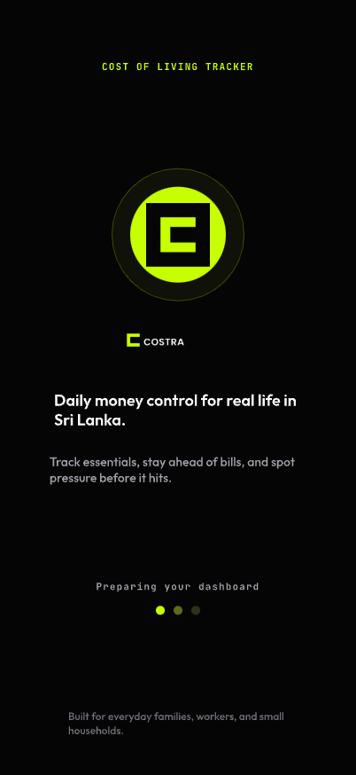
</p>

<h1 align="center">Costra</h1>
<p align="center">
  <strong>Daily money control for real life in Sri Lanka.</strong>
</p>
<p align="center">
  Track essentials, stay ahead of bills, and spot pressure before it hits.
</p>

<p align="center">
  
  
  
  
  
</p>

---

## What is Costra?

Costra is a **mobile-web cost of living tracker** built for Sri Lankan households who need flexible daily and weekly money control instead of rigid monthly budgeting. It's designed for everyday families, workers, and small households managing unstable income in LKR.

This repository is the **frontend implementation** — a pixel-perfect React + TypeScript application built from a complete design system with 24 hi-fi screens, animations, and full navigation flow.

---

## App Screens

### Auth Flow

<p align="center">
  
  &nbsp;&nbsp;
  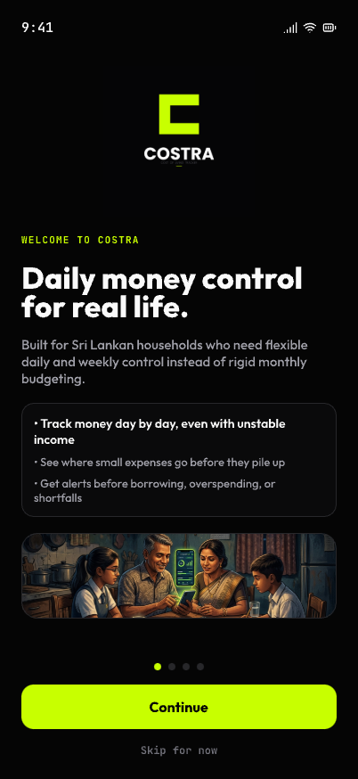
  &nbsp;&nbsp;
  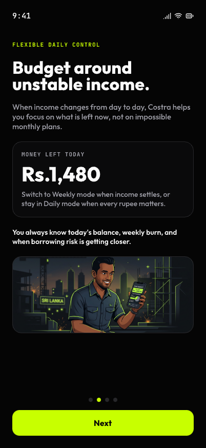
  &nbsp;&nbsp;
  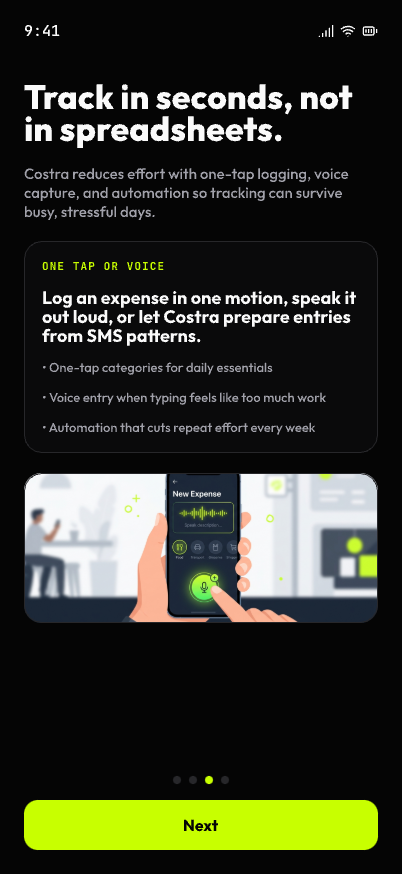
</p>

<p align="center">
  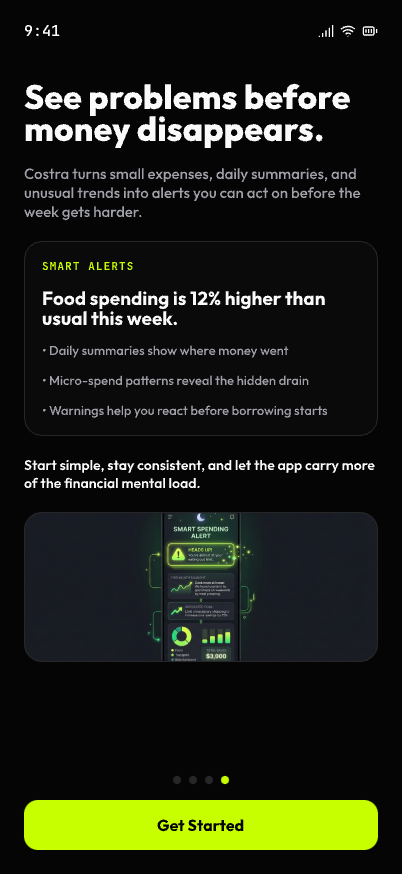
  &nbsp;&nbsp;
  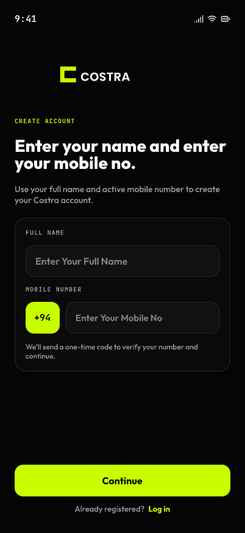
  &nbsp;&nbsp;
  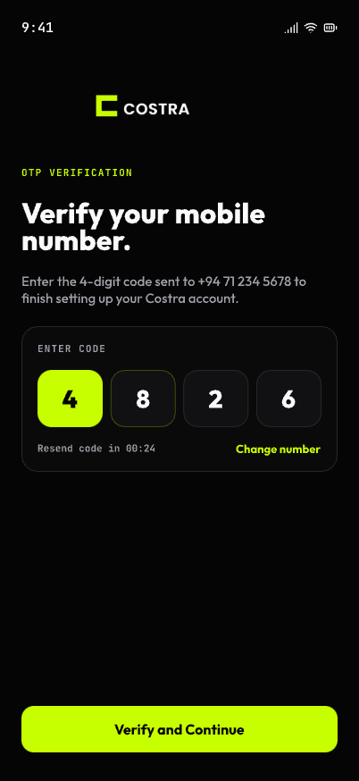
  &nbsp;&nbsp;
  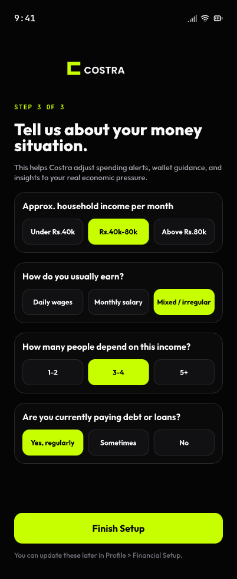
</p>

<p align="center">
  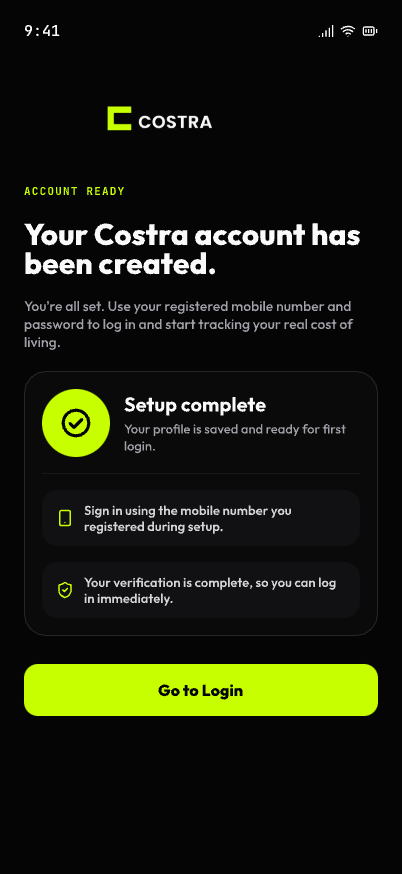
  &nbsp;&nbsp;
  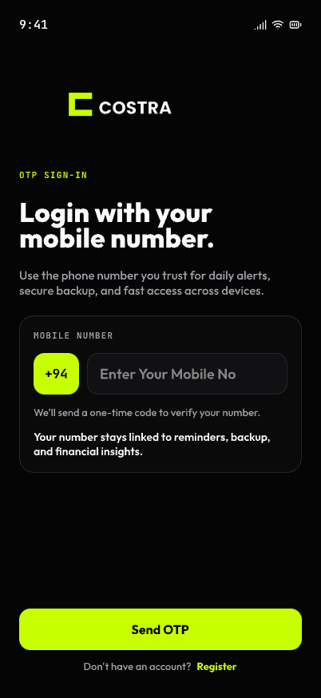
</p>

| Screen | Description |
|--------|-------------|
| **Splash** | Animated brand reveal with Costra logo, auto-navigates forward |
| **Onboarding (4 slides)** | Welcome, Flexible Daily Control, Easy Tracking, Smart Alerts |
| **Register** | Name + phone entry, OTP verification, economic profile questionnaire, account ready confirmation |
| **Login** | OTP-based sign-in with +94 country code |

### Home Flow

<p align="center">
  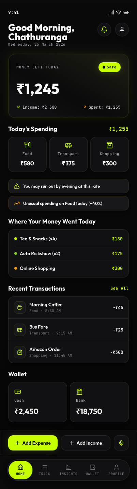
  &nbsp;&nbsp;
  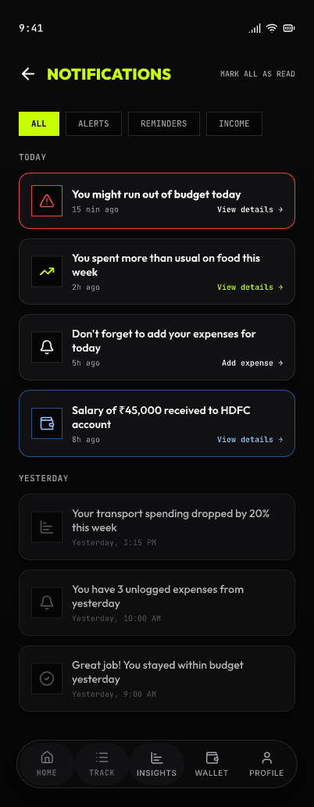
  &nbsp;&nbsp;
  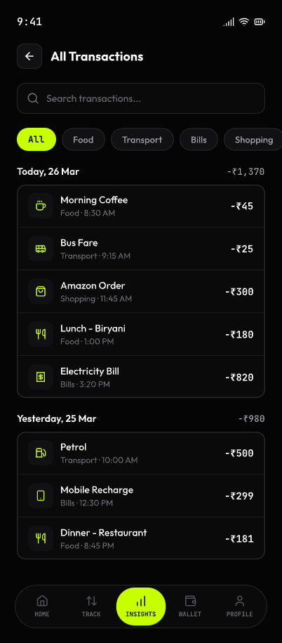
  &nbsp;&nbsp;
  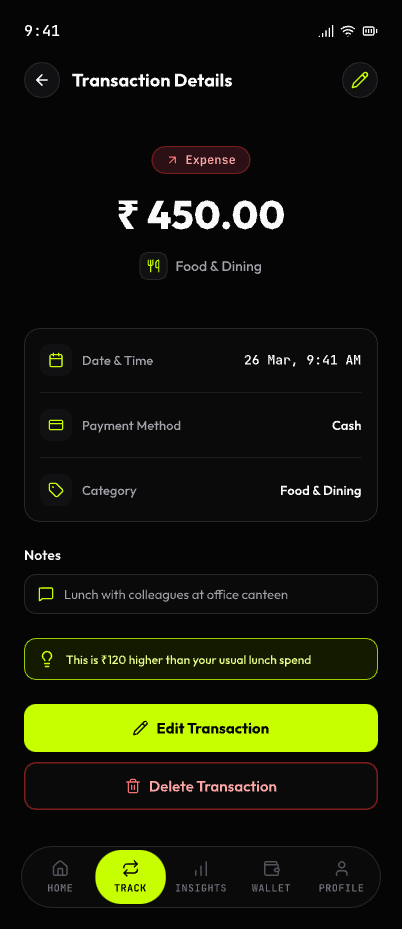
</p>

<p align="center">
  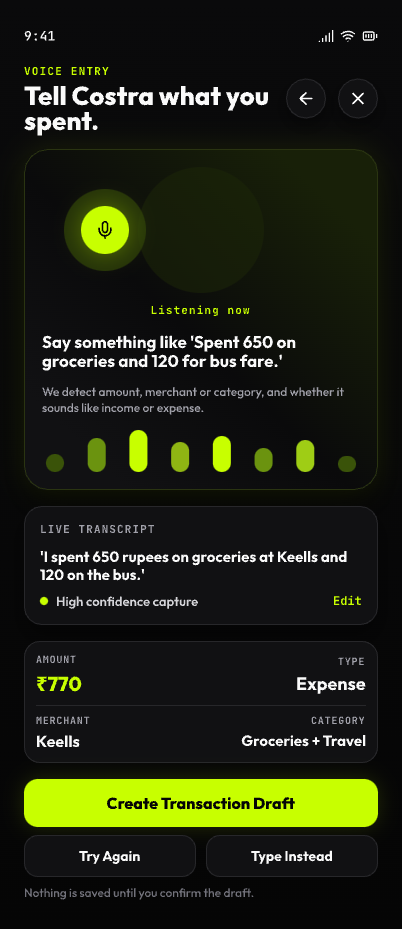
</p>

| Screen | Description |
|--------|-------------|
| **Home** | Dashboard with money-left hero card, today's spending by category, alerts, recent transactions, wallet overview |
| **Notifications** | Filter chips (All/Alerts/Reminders/Income), grouped notification cards with colored borders |
| **All Transactions** | Searchable, filterable transaction list grouped by date |
| **Transaction Details** | Full expense view with category, payment method, notes, spending insight |
| **Voice Entry** | Animated mic with pulse rings, waveform visualization, live transcript, AI-parsed result |

### Track Flow

<p align="center">
  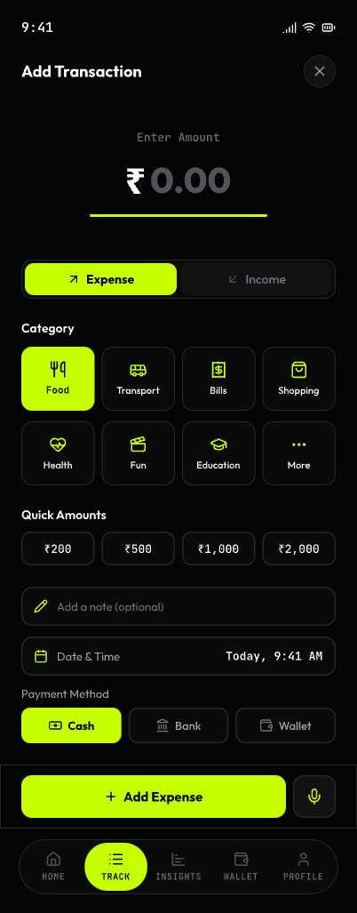
  &nbsp;&nbsp;
  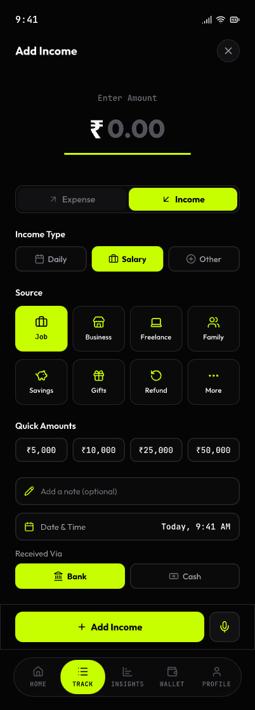
  &nbsp;&nbsp;
  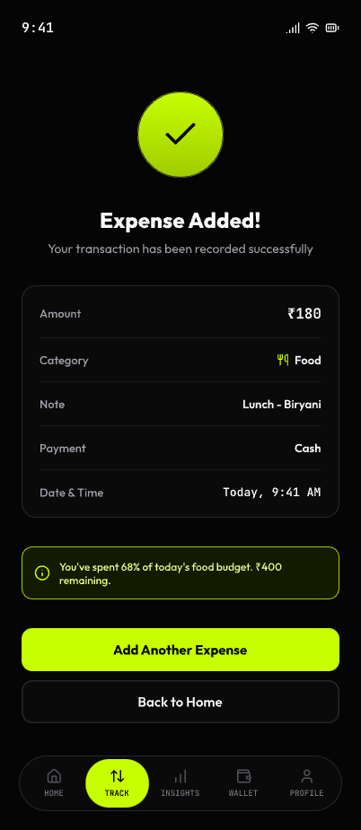
  &nbsp;&nbsp;
  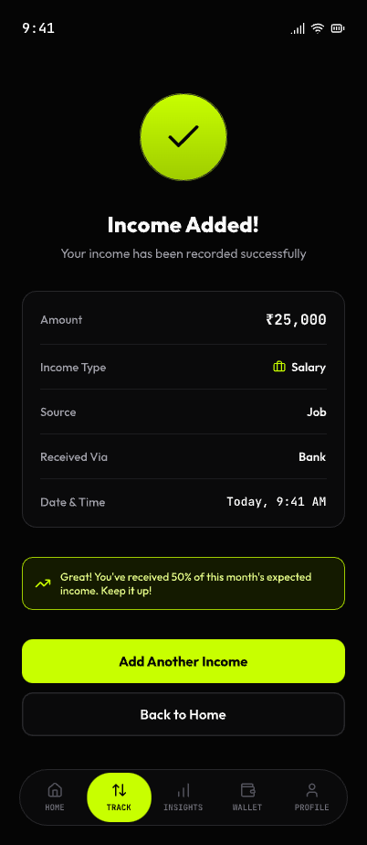
</p>

| Screen | Description |
|--------|-------------|
| **Track (Expense tab)** | Amount entry, Sri Lankan category picker grid, date/wallet/note fields |
| **Track (Income tab)** | Income source selection, amount entry, wallet assignment |
| **Expense Added** | Success confirmation with transaction summary and actions |
| **Income Added** | Success confirmation with income details |

### Insights Flow

<p align="center">
  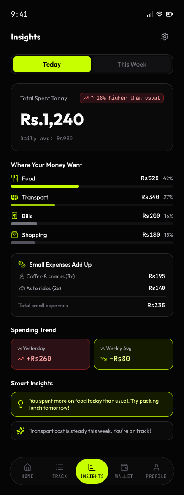
  &nbsp;&nbsp;
  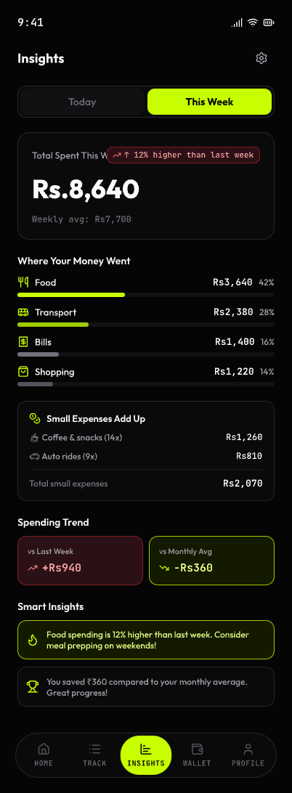
</p>

| Screen | Description |
|--------|-------------|
| **Insights (Today)** | Daily spending breakdown with animated progress bars, category analysis |
| **Insights (This Week)** | Weekly spending trends, budget progress, category comparison |

### Wallet + Profile Flow

<p align="center">
  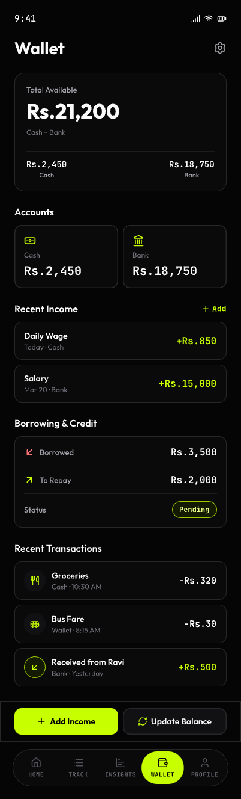
  &nbsp;&nbsp;
  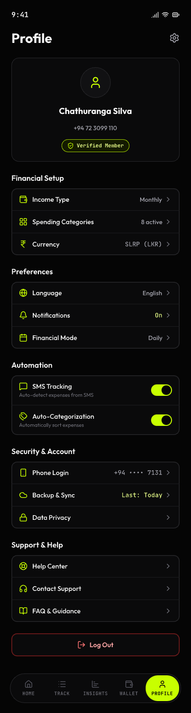
  &nbsp;&nbsp;
  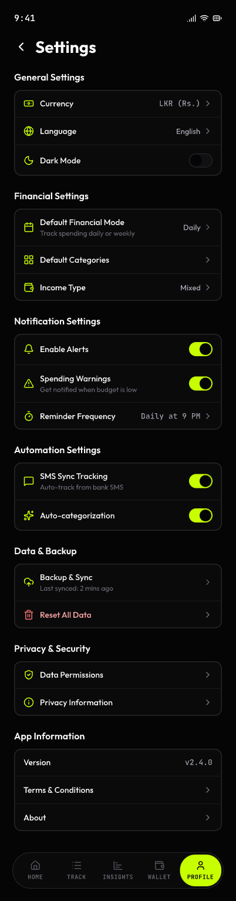
</p>

| Screen | Description |
|--------|-------------|
| **Wallet** | Total balance hero card, Cash/Bank accounts, recent income, borrowing & credit status, recent transactions |
| **Profile** | User identity card with verified badge, financial setup, preferences, automation toggles, security, support |
| **Settings** | General, financial, notification, automation, data/backup, privacy settings with toggles |

---

## Tech Stack

| Layer | Technology |
|-------|-----------|
| **Framework** | React 18 + TypeScript (strict) |
| **Build** | Vite 5 |
| **Styling** | Tailwind CSS v4 via `@tailwindcss/vite` |
| **Routing** | React Router v6 (layout routes) |
| **Icons** | Lucide React |
| **Target** | Mobile-web, iPhone 16 Pro (393px) |

## Design System

| Token | Value |
|-------|-------|
| **Background** | `#050505` (near black) |
| **Surface** | `#0A0A0B` (elevated dark) |
| **Border** | `#1C1C1F` (subtle separator) |
| **Accent** | `#C8FF00` (lime green) |
| **Text Primary** | `#FAFAFA` |
| **Text Secondary** | `#A1A1AA` |
| **Text Muted** | `#52525B` |
| **Success** | `#22C55E` |
| **Danger** | `#EF4444` |
| **Warning** | `#F59E0B` |
| **Font Display** | Outfit (sans-serif) |
| **Font Mono** | JetBrains Mono (monospace) |

Full design system: [Costra Storybook](https://costra-design-system.vercel.app/)

---

## Getting Started

```bash
# Clone the repository
git clone https://github.com/RameshPrashanth98/Costra_Frontend.git
cd Costra_Frontend

# Install dependencies
npm install

# Start development server
npm run dev
```

Open [http://localhost:5173](http://localhost:5173) on your phone or in a mobile-sized browser window.

## Scripts

| Command | Description |
|---------|-------------|
| `npm run dev` | Start Vite dev server |
| `npm run build` | Type-check + production build |
| `npm run preview` | Preview production build locally |
| `npm run lint` | Run ESLint |
| `npm run format` | Format with Prettier |

---

## Project Structure

```
src/
  flows/
    splash/screens/         # Splash screen with brand animation
    onboarding/screens/     # 4-slide onboarding carousel
    welcome/screens/        # Welcome screen
    register/screens/       # 4-step registration flow
    login/screens/          # OTP sign-in
    home/screens/           # Dashboard with budget & spending
    notifications/screens/  # Notification center
    transactions/screens/   # Transaction list + details
    voice-entry/screens/    # Voice expense entry
    track/screens/          # Expense/Income tracking + success screens
    insights/screens/       # Spending analytics (Today/Weekly)
    wallet/screens/         # Wallet management
    profile/screens/        # Profile + Settings
  layouts/
    AuthLayout.tsx          # Auth flow wrapper
    AppLayout.tsx           # App wrapper with BottomNav (5 tabs)
  tokens/
    index.css               # Design tokens (@theme)
  data/                     # Mock data layer
```

## Architecture

- **Route-level code splitting** with `React.lazy` + `Suspense` — 18 separate JS chunks
- **`min-h-[100dvh]`** for iOS Safari dynamic viewport fix
- **Safe-area insets** via `env(safe-area-inset-*)` for notched devices
- **`viewport-fit=cover`** meta tag for edge-to-edge rendering
- **Staggered animations** on every screen (fadeUp, slideIn, pulse, pop)
- **Interactive hover/press states** with spring-based transitions

---

## Navigation Flow

```
Splash --> Welcome --> Onboarding (4 slides) --> Register (4 steps) --> Home
                                             \-> Login --> Home

Home --- BottomNav --> Track --> Expense Added / Income Added
    |                  Insights
    |                  Wallet
    |                  Profile --> Settings
    |
    |-- Notifications
    |-- All Transactions --> Transaction Details
    \-- Voice Entry
```

---

## Status

**24 hi-fi screens implemented** across 9 user flows:

- [x] Splash + Welcome
- [x] Onboarding (4 slides)
- [x] Register (4 steps) + Login
- [x] Home Dashboard
- [x] Notifications
- [x] All Transactions + Transaction Details
- [x] Voice Entry
- [x] Track (Expense + Income) + Success Screens
- [x] Insights (Today + This Week)
- [x] Wallet
- [x] Profile + Settings

---

<p align="center">
  Built for everyday families, workers, and small households in Sri Lanka.
</p>
<p align="center">
  <strong>Currency:</strong> LKR &nbsp;|&nbsp; <strong>Language:</strong> English &nbsp;|&nbsp; <strong>Platform:</strong> Mobile Web
</p>
